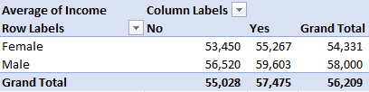
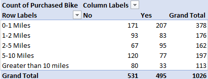
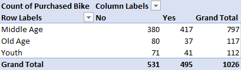
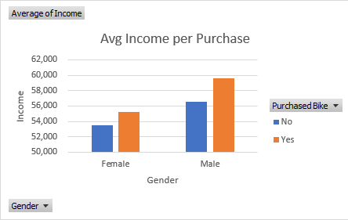
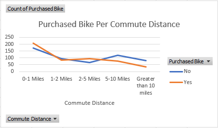
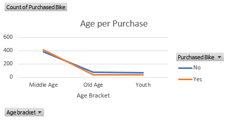
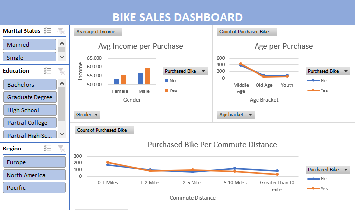

# Bike Sales Analysis

## Introduction
This project created a sales dashboard for a bike company using Microsoft Excel. The dashboard uses customer data to understand the demography of people who purchased bikes or did not.

*Disclaimer* : All dataset and reports do not represent any company, institution or country, but just a dummy dataset to demonstrate capabilities of Microsoft Excel.

## Problem Statement

1. What is the average income made by each gender per purchase?
2. How does commute distance affect the likelihood of purchasing a bike?
3. What is the age range of people who are most likely to purchase a bike?

## Skills/Concept demonstrated:

The following Microsoft Excel skills and features were incorporated:
- Data cleaning
- Pivot tables
- Charts
- Dashboards

## Data cleaning
The first step was to clean the data to remove any errors or inconsistencies. This included removing blank rows and columns, correcting typos, and merging duplicate records.

## Pivot tables
Once the data was clean, pivot tables were used to analyze the data. Pivot tables are a powerful tool for summarizing data and can be used to answer a variety of questions. In this project, pivot tables were used to create the following reports:

- **Average income made by each gender per purchase**

- **Purchased bike per commute distance**

- **Age per purchase**

## Charts
Charts were then created for each pivot table report. This helped to visualize the data and make it easier to understand. The following charts were created:

- **Bar chart of average income made by each gender per purchase**

- **Line chart of purchased bike per commute distance**

- **Line chart of age per purchase**

## Dashboard
The charts were then copied to a new sheet and used to create a dashboard. The dashboard was arranged in an aesthetically pleasing way and given an header title "Bike Sales Dashboard". Slicers were also added to the dashboard to allow users to filter the data by marital status, education, and region.

## Conclusion
This project successfully created a sales dashboard for a bike company using Microsoft Excel. The dashboard uses customer data to understand the demography of people who purchased bikes or did not. The dashboard is easy to use and provides valuable insights into customer behavior.

The Excel workbook containing the data and dashboard 
